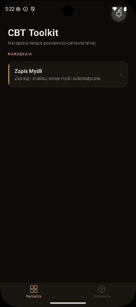
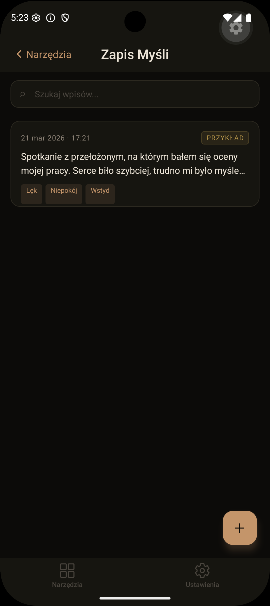
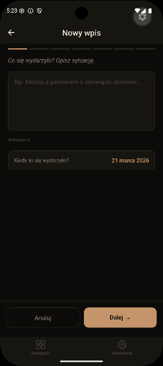
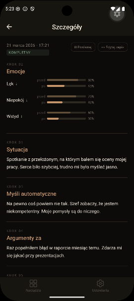
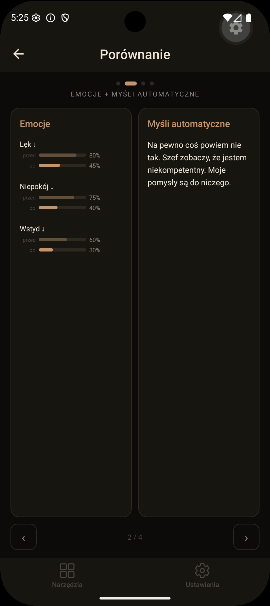

# CBT Toolkit

> A Polish-language mobile app providing Cognitive Behavioral Therapy (CBT) tools. Built with React Native + Expo for Android and iOS.

---

## Screenshots

<table>
  <tr>
    <td align="center"><br/><sub>Home</sub></td>
    <td align="center"><br/><sub>Record List</sub></td>
    <td align="center"><br/><sub>New Record</sub></td>
    <td align="center"><br/><sub>Record Detail</sub></td>
    <td align="center"><br/><sub>Emotion Compare</sub></td>
  </tr>
</table>

---

## Features

### Thought Record
A guided 7-step CBT thought journal:

1. **Situation** — describe the event and when it happened
2. **Emotions (before)** — select emotions and rate intensity (0–100)
3. **Automatic thoughts** — capture what went through your mind
4. **Evidence for** — facts that support the thought
5. **Evidence against** — facts that contradict the thought
6. **Alternative thought** — a more balanced perspective
7. **Emotions (after)** — re-rate emotional intensity

**Additional capabilities:**
- Search and filter records
- Side-by-side emotion comparison (before vs. after)
- Edit existing records
- Delete with confirmation dialog
- Onboarding example record on first launch
- Collapsible step hints throughout the flow

---

## Tech Stack

| Layer | Technology |
|-------|------------|
| Framework | React Native + Expo SDK |
| Routing | expo-router (file-based) |
| Database | expo-sqlite |
| State | Zustand |
| Tests | Jest + @testing-library/react-native |
| Language | TypeScript (strict mode) |

---

## Getting Started

### Prerequisites
- Node.js 18+
- Android Studio with Android SDK (for native builds)
- or: [Expo Go](https://expo.dev/go) app on your device

### Development

```bash
npm install
npx expo start
```

Then press `a` to open in an Android emulator, or scan the QR code with Expo Go.

### Build APK

```bash
npx expo run:android --variant release
```

Output: `android/app/build/outputs/apk/release/`

### Run Tests

```bash
npm test
```

29 tests across 7 suites covering components, hooks, and screens.

---

## Architecture

The app is a **modular platform** — a shell hosting independent CBT tool modules. Adding a new tool requires zero changes to existing code.

```
src/
├── app/                    # Expo Router file-based routing
│   ├── _layout.tsx         # Root layout (tabs, SafeAreaProvider)
│   ├── index.tsx           # Home screen — tool launcher
│   └── (tools)/            # Tool routes
├── core/                   # Shared infrastructure
│   ├── db/                 # SQLite init + migration runner
│   ├── theme/              # Color and spacing tokens
│   ├── types/              # Shared types (ToolDefinition, Emotion)
│   └── components/         # EmotionPicker, IntensitySlider
└── tools/
    └── thought-record/     # Self-contained tool module
        ├── index.ts        # Tool registry entry
        ├── repository.ts   # SQLite data layer
        ├── hooks/          # useThoughtRecords, useThoughtRecord
        ├── screens/        # List, Detail, New record flow
        ├── components/     # StepHelper, CompareScreen
        ├── i18n/pl.ts      # Polish UI strings
        └── migrations/     # DB migrations
```

---

## Roadmap

- [x] Thought Record — full 7-step flow, list, detail, delete
- [x] Emotion comparison, edit, search, onboarding, step hints
- [ ] Second CBT tool (Behavioral Experiment)
- [ ] Light / dark theme toggle
- [ ] Google Play + App Store release

---

## License

[CC BY-NC 4.0](LICENCE.md) — free to use and adapt for non-commercial purposes.
