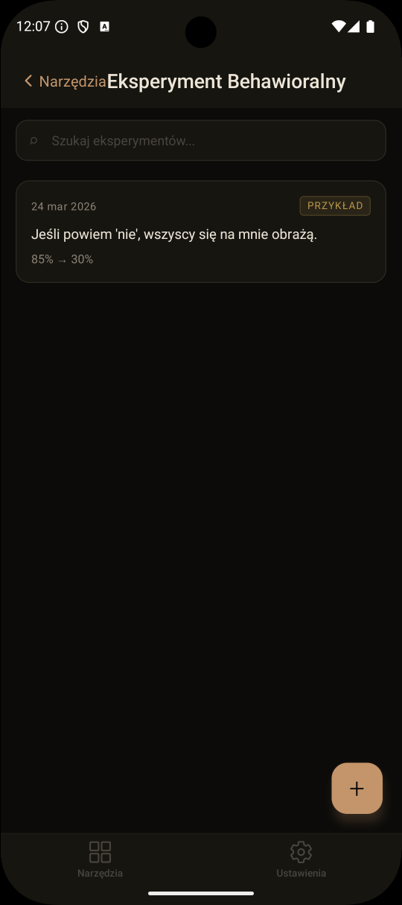
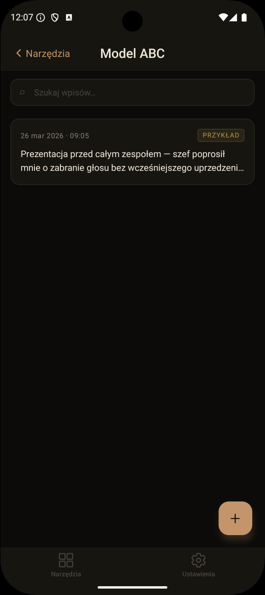
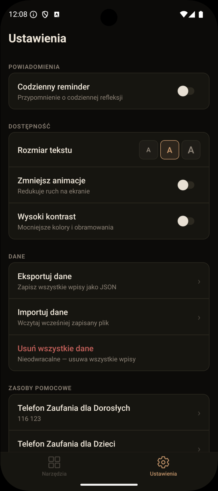

# CBT Toolkit

> A Polish-language mobile app providing Cognitive Behavioral Therapy (CBT) tools. Built with React Native + Expo for Android and iOS.

---

## Screenshots

<table>
  <tr>
    <td align="center"><br/><sub>Home</sub></td>
    <td align="center"><br/><sub>Thought Record</sub></td>
    <td align="center"><br/><sub>Behavioral Experiment</sub></td>
    <td align="center"><br/><sub>ABC Model</sub></td>
    <td align="center"><br/><sub>Settings</sub></td>
  </tr>
</table>

---

## Features

### Thought Record
A guided 7-step CBT thought journal:

1. **Situation** — describe the event and when it happened
2. **Emotions (before)** — select emotions and rate intensity (0–100)
3. **Automatic thoughts** — capture what went through your mind
4. **Evidence for** — facts that support the thought
5. **Evidence against** — facts that contradict the thought
6. **Alternative thought** — a more balanced perspective
7. **Emotions (after)** — re-rate emotional intensity

**Additional capabilities:**
- Search and filter records
- Side-by-side emotion comparison (before vs. after)
- Edit existing records
- Delete with confirmation
- Onboarding example record on first launch
- Collapsible step hints throughout the flow

---

### Behavioral Experiment
A structured tool for testing negative beliefs through real-world experiments:

1. **Belief** — state the belief and rate its strength (0–100)
2. **Alternative belief** — formulate a balanced counter-belief
3. **Experiment plan** — describe what you will do
4. **Prediction** — what do you expect to happen?
5. **Safety behaviours** — identify behaviours that might prevent a fair test
6. **Schedule** — pick a date for the experiment
7. **Results** — record what actually happened and re-rate belief strength

**Additional capabilities:**
- Status transitions: `Planned` → `Completed` / `Abandoned`
- Experiment list with status badges and date
- Edit and delete with confirmation

---

### Settings
- **Notifications** — daily reminder at a configurable time
- **Accessibility** — font size (S/M/L), reduced motion, high contrast
- **Data export** — full JSON backup including settings, shared via native share sheet
- **Data import** — restore from backup file; duplicates are skipped safely
- **Delete all data** — with two-step confirmation
- Credits and Bibliography screens

---

## Tech Stack

| Layer | Technology |
|-------|------------|
| Framework | React Native + Expo SDK 55 |
| Routing | expo-router (file-based) |
| Database | expo-sqlite |
| State | Zustand + AsyncStorage persist |
| Tests | Jest + @testing-library/react-native |
| Language | TypeScript (strict mode) |

---

## Getting Started

### Prerequisites
- Node.js 18+
- Android Studio with Android SDK (for native builds)
- or: [Expo Go](https://expo.dev/go) app on your device

### Development

```bash
npm install
npx expo start
```

Then press `a` to open in an Android emulator, or scan the QR code with Expo Go.

### Build APK

```bash
npx expo prebuild --platform android --clean
cd android
JAVA_HOME=~/.gradle/jdks/eclipse_adoptium-17-amd64-windows.2 ./gradlew assembleRelease
```

Output: `android/app/build/outputs/apk/release/app-release.apk`

### Run Tests

```bash
npm test
```

88 tests across 22 suites covering components, hooks, screens, and data layer.

---

## Architecture

The app is a **modular platform** — a shell hosting independent CBT tool modules. Adding a new tool requires zero changes to existing code.

```
src/
├── app/                    # Expo Router file-based routing
│   ├── _layout.tsx         # Root layout (tabs, DB init, notification sync)
│   ├── index.tsx           # Home screen — tool launcher
│   ├── settings/           # Settings, Credits, Bibliography screens
│   └── (tools)/            # Tool routes
├── core/                   # Shared infrastructure
│   ├── db/                 # SQLite init + migration runner
│   ├── theme/              # Color tokens, useColors() (high contrast support)
│   ├── settings/           # Zustand settings store + font scaling
│   ├── notifications/      # Permission request + daily reminder scheduling
│   ├── data/               # Export and import logic
│   ├── i18n/               # Polish UI strings
│   ├── types/              # Shared types (ToolDefinition, Emotion)
│   └── components/         # EmotionPicker, IntensitySlider, StepHelper, StepProgress
└── tools/
    ├── thought-record/     # Self-contained CBT module
    │   ├── index.ts        # Tool registry entry
    │   ├── repository.ts   # SQLite data layer
    │   ├── hooks/          # useThoughtRecords, useThoughtRecord
    │   ├── screens/        # List, Detail, New/Edit flow, Compare
    │   └── migrations/     # DB migrations
    └── behavioral-experiment/
        ├── index.ts
        ├── repository.ts
        ├── hooks/
        ├── screens/        # List, Detail, New/Edit flow
        └── migrations/
```

---

## License

[PolyForm Noncommercial 1.0](LICENCE.md) — free to use for non-commercial purposes.
